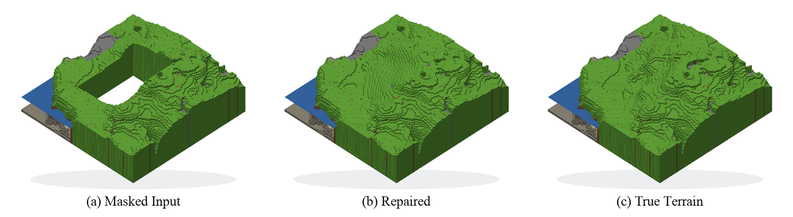
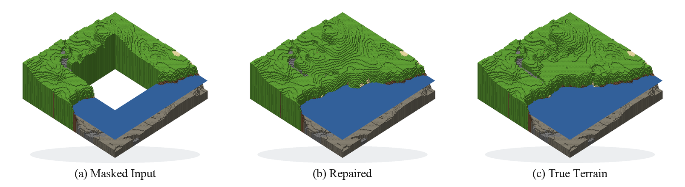
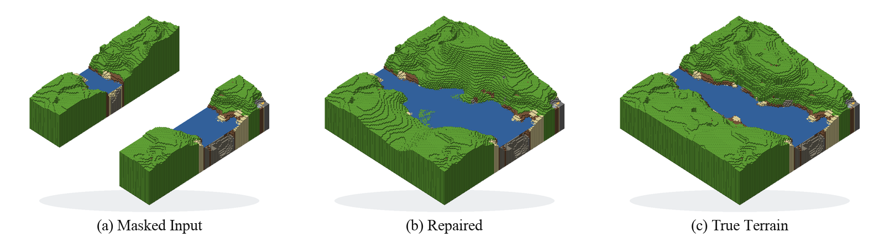
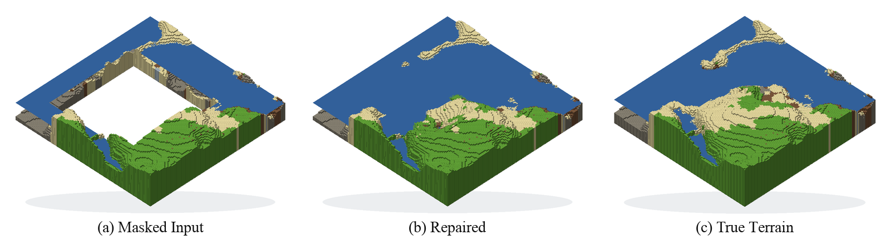

# Minecraft Terrain Repair

This repo exports surface-aligned Minecraft terrain tiles, renders them for inspection, and trains a deterministic U-Net to repair masked regions so they settle back into vanilla-like terrain.

The practical use case is terrain cleanup after large edits. If you clear out space for a base, castle, megaproject, rail line, or other large build, the surrounding land often ends up with harsh cut lines that no longer look like naturally generated Minecraft. The repair model is meant to fill those damaged regions back in with terrain that blends into the nearby world instead of looking hand-patched.

This repo provides:

- A Minecraft terrain exporter that converts local worlds into compact surface height and material tensors.
- A deterministic repair U-Net for reconstructing masked terrain regions from nearby context.
- Shared repair cases for validation and qualitative comparisons.
- Lightweight renderers for inspection, 3D viewing, and figure-ready isometric PNGs.

Repository layout:

- `packages/exporter`: reads Minecraft regions and writes `surface_*.npy` and `chunk_*.npy`.
- `packages/unet`: dataset assembly, training, inference, and validation.
- `packages/render`: lightweight 3D viewer and figure exporter for saved repair outputs.
- `scripts/`: thin CLI wrappers around the workspace packages.

## Requirements

- Python 3.11 to 3.14
- [`uv`](https://docs.astral.sh/uv/)
- A local Minecraft world if you want to export your own data

If you are generating your own worlds for training or evaluation, disable structures so villages, temples, and other generated builds do not get mixed into the terrain data.

## Setup

Install the workspace and all package extras:

```bash
make sync
```

Run the test suite once to make sure the environment is healthy:

```bash
make test
```

## Typical Workflow

### 1. Export terrain

Point `WORLD` at either a save root or the overworld directory itself:

```bash
make export WORLD=/path/to/World
```

```bash
make export WORLD=/path/to/World OUT=./data/chunks LIMIT=512 WORKERS=4
```

The exporter writes chunk-aligned `.npy` arrays into `OUT`:

- `surface_x_z.npy`: 16x16 surface heights
- `chunk_x_z.npy`: 16x16x40 surface-anchored material slabs

Surfaces keep the terrain as a compact representation reduced to our vocabulary of allowed surface block classes. Blocks outside that list are represented as air.

The `chunk_x_z.npy` file stores a shallow vertical strip around that surface anchor for each `(x, z)` chunk. We use that depth information mainly to derive surface material and a simple support signal.

### 2. Visualize the export

Before training, it is worth checking whether the export actually looks sane:

```bash
make visualize OUT=./data/chunks
```

This generates stitched maps and sample previews under the render output directory.

### 3. Train the repair U-Net

The main training path uses PyTorch Lightning:

```bash
make train OUT=./data/chunks EPOCHS=10 BATCH_SIZE=2
```

Common knobs:

```bash
make train \
  OUT=./data/chunks \
  EPOCHS=25 \
  BATCH_SIZE=4 \
  LIGHTNING_DEVICES=1 \
  AMP=auto \
  MODEL_BASE_CHANNELS=64 \
  MODEL_DEPTH=4 \
  TRAIN_TILE_SIZE=128
```

Our training was done on exported sections from multiple worlds and multiple parts of those worlds to expose the model to a broad mix of terrain shapes and materials: coastlines, rivers, hillsides, beaches, snow and ice transitions, flatter plains, and rougher elevation changes.

Artifacts land in:

- `artifacts/repair.pt`: latest compatible checkpoint
- `artifacts/repair_latest.pt`: rolling latest snapshot
- `artifacts/repair_best.pt`: best validation checkpoint
- `artifacts/lightning/`: Lightning logs and checkpoint files

Validation runs against the shared saved cases in `repair_cases/` during training. If you need the older plain PyTorch loop, `make train-legacy` is still available.

### Model Snapshot

The repair model is a deterministic U-Net that predicts a height residual, surface material logits, and a support proxy for the masked terrain region. It conditions on the known normalized height, a simple prefilled height estimate, the mask, boundary distance, prefill gradients and Laplacian, known support, and one-hot surface material classes.

The current v2 configuration uses 64 base channels, four encoder/decoder stages, residual blocks, and a dilated bottleneck with dilation rates `1,2,4,2` to increase terrain-scale context without changing the 128x128 tile interface.

## Training run snapshot:

- Dataset scale: 52 worlds, 4,096 chunks per world, 212,992 chunks total.
- Epoch: 350
- Validation score: 0.0528
- Height MAE: 0.0097
- Seam MAE: 0.0019
- Material accuracy: 0.7922
- Support MSE: 0.0068
- Training loss: 0.033

### Hillside



### Coast



### River



### Sandy Beach



## Inference And Evaluation

Prepare a scratch inference window from exported terrain:

```bash
make prepare-infer OUT=./data/chunks
make infer
```

Run the shared regression-style repair cases:

```bash
make repair
make repair-case CASE=Beach
```

Open the local selector GUI for choosing a repair region interactively:

```bash
make infer-gui OUT=./data/chunks
```

View saved repair outputs in the 3D viewer:

```bash
make view-repair
```

Export white-background isometric triptychs:

```bash
make generate-figures
```

Each case renders as masked input, repaired terrain, and true terrain under `outputs/figures/`, plus a stacked `all_cases.png` contact sheet.

## Common Commands

```bash
make help
make test
make analyze-variance OUT=./data/chunks
make train-lightning
make train-legacy
make repair
```

## References

- [InfiniteDiffusion: Bridging Learned Fidelity and Procedural Utility for Open-World Terrain Generation](https://arxiv.org/abs/2512.08309)
- [Image Inpainting for Irregular Holes Using Partial Convolutions](https://arxiv.org/abs/1804.07723)
- [Free-Form Image Inpainting with Gated Convolution](https://arxiv.org/abs/1806.03589)
- [Resolution-Robust Large Mask Inpainting with Fourier Convolutions](https://arxiv.org/abs/2109.07161)
